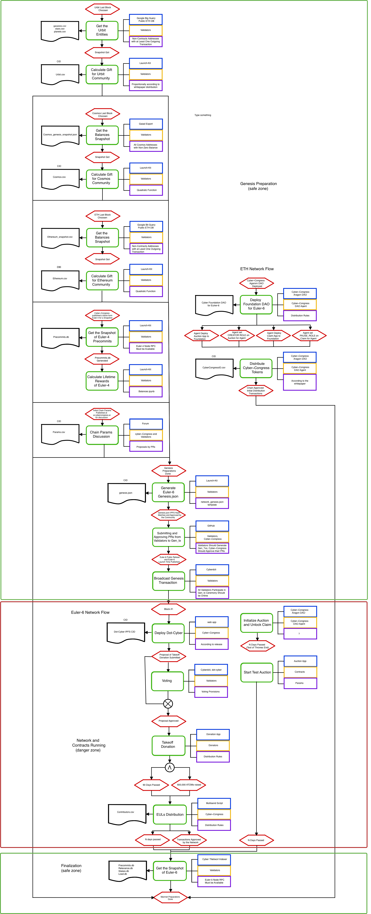

# Launch kit

An awesome must-have toolkit and a protocol for the Genesis launch. This toolkit provides a launch protocol for cosmos-based networks, recommended workflow and necessary tools for `genesis.json` compilation. Also, it contains a crisis protocol.

The network launch is a complex process with many dependent factors. It starts with developing distribution and do not end with the first block of the network. This repo is at the same time example of a working launch process we practice. It does not pretend to be some unique method for launch by all projects but the experience saved here is very useful for future great projects.

## ToC

- [Launch protocol](#launch-protocol)
- [Workflow](#workflow)
- [Tools](#tools)
- [Network params](#network-params)
- [Distribution params](#distribution-params)
- [Points of truth](#points-of-truth)

## Launch protocol

In general, the protocol has three zones:

- Genesis preparation
- Network and contracts running
- Finalization

The Genesis preparation zone is about collecting addresses for distribution, distribution parameters, network parameters, and genesis transactions. All collected data is integrating into `genesis.json` by the `network_genesis.json` template. 

Also, this zone is about setupping  DAO as a governance entity.

The network and contracts running zone is the stage between block #1 of the launch network and the latest block of the network. The latest block is defined by the result of the takeoff donation round. In other words: the latest block should be after all of pending DAO commitments. This zone is defined as a danger zone because of a possible fault risk of network, contracts, all both of them.

This zone contains three major events:

- Deploying the web app for interacting with the network and DAO functions
- Takeoff donation round starting
- Deploying the contracts for the Auction
- Tokens distribution

The finalization zone should be available only after tokens distribution (as pended commitment). The main event of this zone is mainnet preparations done.

## Workflow

1. Develop your distribution for the launch. This is the most important step in this guide. What is the total genesis supply?
 Which communities should be involved? How to distribute tokens? What's the method for distribution you want to use? How many tokens you want to distribute to the foundation, team, donors, inventors and so on. Our example you can see at [distribution](./distribution/README.md) directory.

2. According to your distribution set up the `cyber_distribution.json` and `manual_distribution.json` files with necessary values. More about that at  [distribution](./distribution/README.md) directory. 

3. Set parameters for the network. At the [params](./params/README.md) directory you can open a discussion for the great params decision. Put all params inside `network_genesis.json`. 

4. Select a set of tools for genesis accounts preparation. This story about communities gifts, if your distribution includes the gifts for communities (like ours). There are two ways to include the group of addresses in the genesis file: 

- With genesis-generator-tool built-in method (quadratic function)
- With custom method

In the first case, you just need a `.csv` file with addresses and native chain balances. The genesis-generator tool will parse distribution files and apply the quadratic function to this group. 

> Notice. The addresses should be converted into the your-network format. For details visit provided [converter](./cyber_address_converter/README.md).

In the second case, you can calculate the balances as you want, and the genesis generator tool just inserts it in the right format. But you should carry about the distribution sum by yourself. This sum should compare with value at `cyber_distribution.json`. More technical details at the [genesis-generator-tool](./genesis-generator-tool/README.md). 

5. After you prepared all the files you need to move it to `genesis-generator-tool/data` and start the genesis generation.

## Tools

- [The Game rewards tools](./game_rewards_calculations/README.md) for calculating rewards after incentivize game
- [ETH and Cosmos to Cyber converter](./cyber_address_converter/README.md). `ETH -> cosmos-based` addresses converter and `cosmos-based -> cosmos-based` converter
- [ETH gift distributor](./ethereum_gift_tool/README.md) for collecting ethereum non-contract addresses with at list one outgoing transaction on a given blog height
- [Cosmos gift distributor](./cosmos_gift_tool/README.md) for parsing cosmos addresses from state exported file on a given blog height
- [Urbit gift distributor](./urbit_gift_tool/README.md) for collecting Urbit entities on given block height, getting their owners and distributing gifts. 
- [Genesis generator](./genesis_generator_tool/README.md) for generating genesis file
- [Data exporters](./cyberlink_exporter/README.md) for exporting data from the network. Now available exporting cyberlinks by account on given block height

## Network params

The network paramas available at `params` [README](/params/README.md)

## Distribution params

The distribution paramas available at `distribution` [README](/distribution/README.md)

---

## Points of truth

|File name | Description | IPFS hash | 
| ---------|-------------|-----------|
| cosmos.csv | cosmos network balances state at block 1110000 |  QmcgfjcNwucHrSrWFNxKGYLjLouedYjyeP3hRrqD6P8m9K |
| ethereum.csv | ethereum network balances state at block 8080808, exclude contracts and addresses without at least one outgoing transaction | QmVCMwK3273Wb4gddzmxiitquCe844Qe63SWVyWFA8gEsT |
| galaxies_balance.csv | galaxies balances on non-contract addresses with at least one outgoing transaction. At 9110129 block state | QmR7nbMZDrQE5wLoUhgKJ6pZiUkCyJ4bCfgDEyWGfH3SvJ |
| stars_balance.csv | stars balances on non-contract addresses with at least one outgoing transaction. At 9110129 block state | QmUkXZcHB9L3cg2uqMC5ejkCaD3eWsZRmyuWtdATxZUMKj |
| planets_balance.csv | planets balances on non-contract addresses with at least one outgoing transaction. At 9110129 block state | QmZjc2KEQMpvK3dudsyar1Qzq6e4M5ds3CCteUXbne6zxs |
| euler-6 genesis.json unsigned | | QmYrZuyMvskb2tkY65Go1Dadh1axXjY4x3VfFadaSSRf8b |
| cyber_distribution | the distribution by user groups in euler-5/6 | QmfW6pEsHnC76ZWwGgtbhnRq4fJrUdiU9tz9M2oUnw3JNr |
| manual_distribution.json | the manual distribution inside groups in euler-5/6 | QmbEX1yNqCXbLF9fqQbJrE58zm4EXF2A8K6WDy9LjXSecd |
| network_genesis.json | the genesis.json template with current params for euler-6 | QmNboiSbS4TP6xptek6uyUnuxL3uL4Xef9qbyR7BvuH8Sf |
| cyberlinks.json | the euler-5 cyberlinks by address at 1580000 block height | QmNsDrgrJfGvs4Z6mg7XU5KMjg49FGtjUET1NqNoCynrzP |
| precommits.csv | precommits count by validator at euler-5 testnet at 1580000 block height | QmdfktVx9jpRx45WTAW9YkfbVijr2pC1AyvuhcS2bSgULk |
| euler-6 genesis.json signed | | QmZHpLc3H5RMXp3Z4LURNpKgNfXd3NZ8pZLYbjNFPL6T5n |