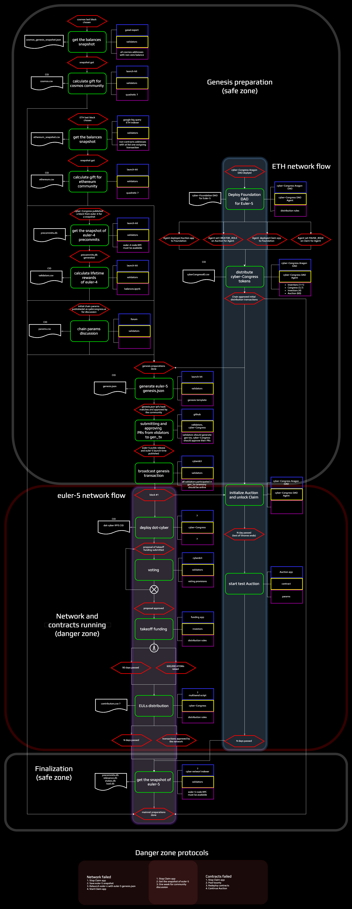

# Launch kit
An awesome must-have toolkit and a protocol for the Genesis launch 

## Launch protocol

## Tools

- Lifetime rewards tool
- Load rewards tool
- Staking rewards tool
- Relevance rewards tool
- ETH to Cyber converter
- Cosmos to Cyber converter
- ETH gift distributor
- Cosmos gift distributor
- Genesis generator

## The workflow

## Chain params

The chain paramas available at `params` [README](/params/README.md)

## Distribution params
(Please see explanatory notes below the table)

| Parameters                             | `euler-5`   | `cyber`    |Notes|
|:----------------------------------|:-----------:|:----------:|:----:|
|*Distribution params*|
| Foundation contract address      | ?         | ?        | ?  |
| **Foundation token**             | **GOL**   | **THC**  | **ERC20 token in Aragon DAO**  |
| Distr to ETH Game of Thrones         | 100 TGOL  | 100 TTHC | Distribution of gov. tokens for Game of Thrones auction to the ETH community  |
| Auction distr                    | 500 TGOL  | 500 TTHC | Amount of gov. tokens allocated to the auction  |
| cyber~Congress distr             | 97 TGOL   | 97 TTHC  | Amont of gov. tokens allocated to cyber~Congress (inventors, team)   |
| **Chain token**                  | **EUL**   | **CYB**  | **Chain liquid token**  |
| Cosmos gift                      | 10 TEUL   | 10 TCYB  | Chain token gift to the Cosmos community. Each address on block 1110000 entitlted to a gift according to [distribution]() |
| Ethereum gift                    | 90 TEUL   | 90 TCYB  | Chain token gift to the Ethereum community. 99.7% of addresses on block 8080808 are entitiled to a gift according to [distribution]() |
| Validators euler-4 rewards       | 2.7 TEUL  | 2.7 TCYB | For validating during `euler-4`. Calculated per lifetime |
| Community pool                   | 0.3 TEUL  | 0.3 TCYB | Amount of tokens in the community pool at the start |
| Takeoff funding                  | 60 TEUL   | 60 TCYB  | Tokens allocated to takeoff funding |
| Game of Links rewards            | 25 TEUL   | 25 TCYB  | Tokens allocated for Game of Links rewards |
| Community pool, GoL bounty       | 5 TEUL    | 5 TCYB   | ? |
| Full validator set extra rewards | 10 TEUL   | 10 TCYB  | Extara reward to validators if the set of active validators will reach 146 and will last for a period of 10,000 blocks |
| Cosmos Game of Thrones            | 100 TEUL  | 100 TCYB | Chain tokens |
| **SUM**                          | 1000 TEUL | 1000 TCYB|  |
|*Takeoff funding params*|
| Cosmos multisig address          | ?                                                       | - | Congress multisig address for atoms funding|
| Desired Atom funding             | 600,000                                                 | - | The maximum amounts of desired ATOMs for funding|
| Distribution function*           | 0.000740464x^3 - 666.418x^2 +  233280000x + 0.000343014 | - |  |
| Discount function*               | -0.00005x + 30                                          | - | |
| Open funding                     | by proposal                                             | - | The community will decide when funding will begin|
| Max. funding duration              | 90 days                                                 | - | Funding duration if 600,000 ATOMs will not be donated |
|*Auction contract params*|
| Contract address        | ?                      | ?                  | Contract address with allocated tokens |
| Open time               | with `euler-5` launch  | with `cyber` launch| The time of start of round `0` of the auction |
| Created on first day        | 100 TGOL               | 100 TTHC           | Amount of tokens allocated to round `0`|
| Starting time              | open_time + 240h       | open_time + 504h   | The time of start of round 1 |
| Number of rounds        | 49 + 1                 | 499 + 1            | Round zero + daily rounds |
| Created per day          | 8.16326531 TGOL        | 0.80160321 TTHC    | Amount of tokens allocated to each daily round|

\* -  the `x` the is amount of ATOMs funded for the current moment  
\ - distr. = distribution | gov. = governance  
\ - `Foundation token` refers to the Aragon entity that is in charge of the donated ETH as per the [protocol White paper](https://github.com/cybercongress/cyber/blob/master/main.tex). The Aragon DAO is responsible for on-chain governance. Please see out paper for more information  
\ - `Chain token` refers to the main token of the cyber protocol. It is used for staking, bandwith and for ranking. Please see protocol paper for more inforamtion.

